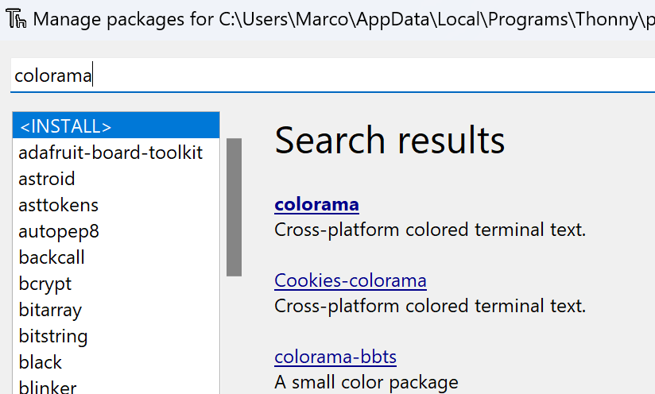

# Auftrag Wordle


In dieser Übung wollen wir das Wordle-Ratespiel programmieren:

https://www.nytimes.com/games/wordle/index.html

## Schritte

1. Datei mit den Wörtern einlesen

Die Datei `wordlist.txt` enthält alle deutschen Wörter mit 5 Buchstaben. Mit dem Befehl `open` kann man eine Datei öffnen. Dabei muss man (auf Windows) noch die Textenkodierung angeben:
```py
f = open("wordlist.txt", encoding="utf-8")
inhalt = f.read()
f.close()
```

2. Mit `random` Ein zufälliges Wort auswählen:

```py
import random

glace = ["Erdbeer", "Schoggi", "Vanille"]
auswahl = random.choice(glace)
print(auswahl)
```


3. Farbigen Text ausgeben:

Zuerst müssen wir die Bibliothek `colorama` installieren. Wähle dazu in Thonny im Menu `Werkzeuge` den Eintrag `Verwalte Pakete ...`. Suche dort im Suchfeld nach `colorama` suchen, auswählen und installieren:




Nun kann man farbigen Text ausgeben:
```py
from colorama import Front, Back, Style

print(f"{Front.BLUE}{Back.YELLOW}Hello!{Style.RESET_ALL}")
```

4. Grosser Game-Loop

In einem grossen `while`-Loop, kann der:ie User:in nach ihrem Wortvorschlag gefragt werden. Der Vorschlag muss überprüft werden: Ist es ein gültiges deutsches Wort mit fünf Buchstaben?

In einem zweiten Schritt kann dann überprüft werden, ob die Lösung schon gefunden wurde. Falls nicht, kann man zuerst nach den korrekt platzierten Buchstaben suchen, und in einem zweiten Schritt nach den Buchstaben, welche im Lösungswort vorkommen, aber nicht korrekt platziert sind.

_Tipp:_ Die farbigen Kästchen vordefinieren und die Ausgabe (Kästchen) per default auf weiss setzen:
```py
white = f"{Back.WHITE} {Style.RESET_ALL}"
yellow = f"{Back.YELLOW} {Style.RESET_ALL}"
green = f"{Back.GREEN} {Style.RESET_ALL}"

results = [white, white, white, white, white]
...
```


#### Mögliche Verbesserungen
 - Eigene Liste mit Lösungswörtern
 - Man kann nur 5 mal raten
 - Buchstabe in die Kästchen reinschreiben
 - Am Schluss wird noch einmal der Spielverlauf angezeigt
 - Man kann das gleiche Wort nur einmal pro Spiel eingeben